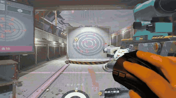
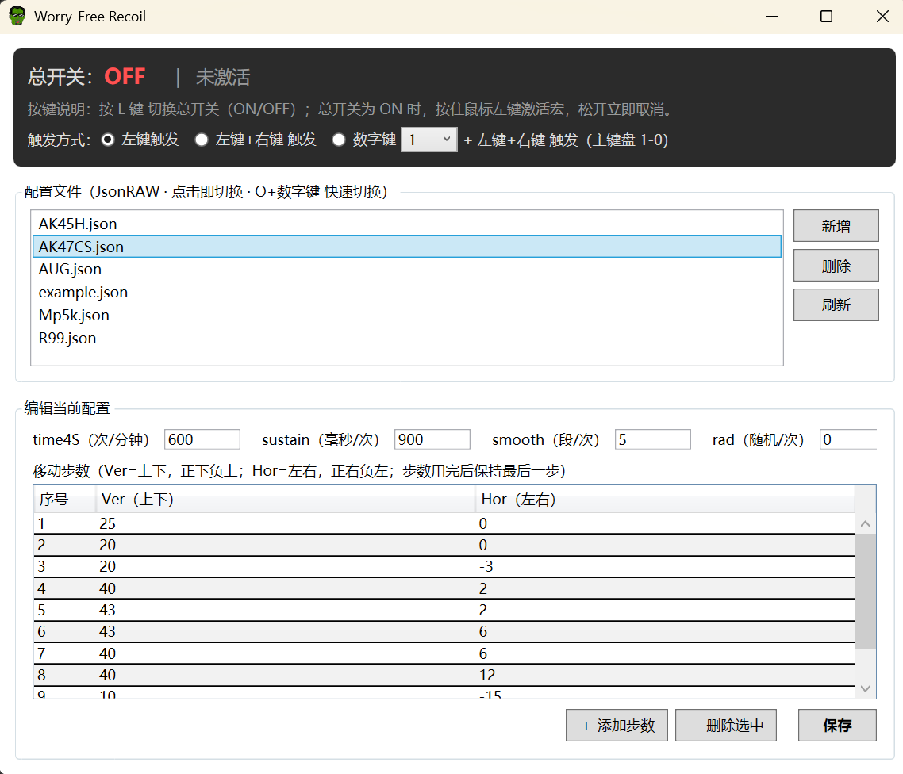
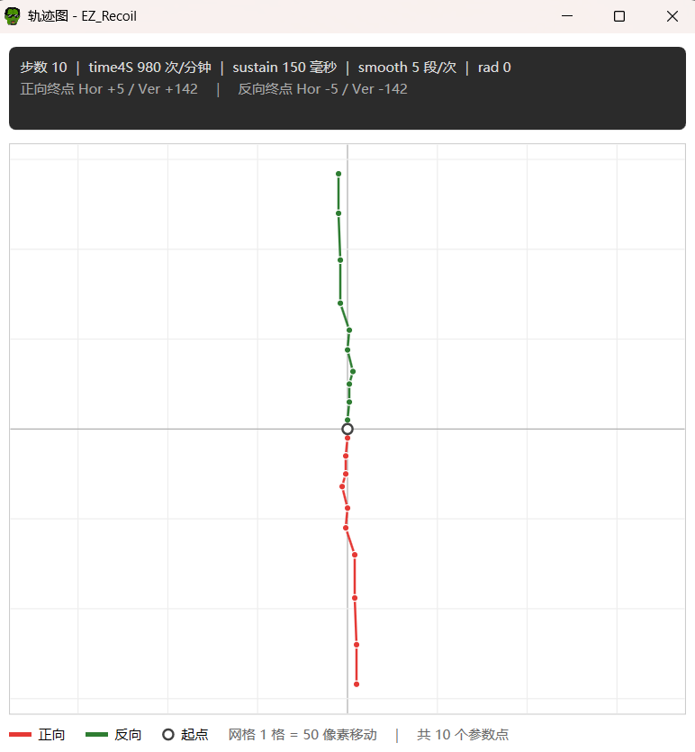

# EZRecoil —— 轻松控制后坐力

> 基于 **.NET 10** 开发，轻量易用。用户自定义后坐力配置文件，支持快速切换。无需管理员权限，无需注入 DLL。

---

- **三种触发**：左键触发 /（左键 + 右键）触发 /（小键盘自定义按键 + 左键 + 右键）触发，一键总开关
- **自定义**：用户自定义后坐力配置文件，支持快速切换
- **轻量易用**：GUI 进程内存占用 **~200MB**，轻松后台运行
- **后座可视**：增加弹道折线图，正反皆可显示，自适应坐标轴
- **无公害**：无需管理员权限，无需注入 DLL

---

  

  **演示动图-R6S/PUBG/CS/BF6**

---

  

  **软件界面预览**

  

  **弹道预览**

##  免责声明

- 本软件**仅供学习与技术研究交流使用**，请勿将其用于任何违反游戏运营规则或国家法律法规的用途。
- 使用本软件所产生的一切后果（包括但不限于账号封禁、设备损坏、法律纠纷等）**由使用者自行承担**。
- 作者不对本软件的功能性、适用性及由此产生的任何直接或间接损失负责。
- 请勿在任何正式游戏对局中使用。
